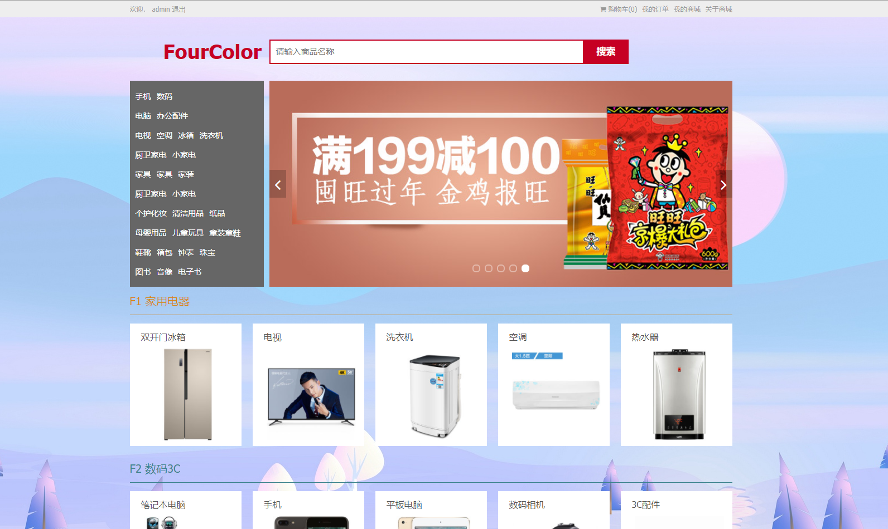
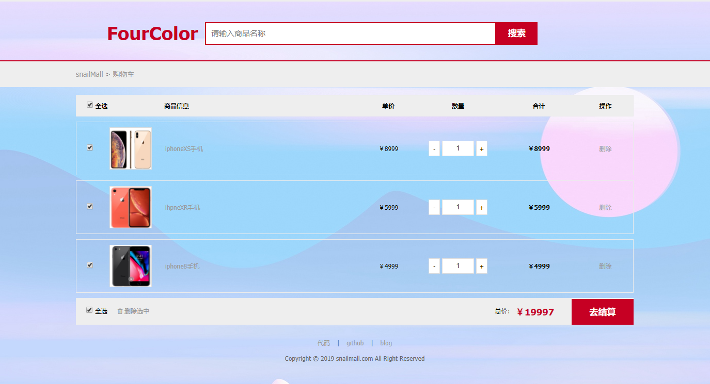
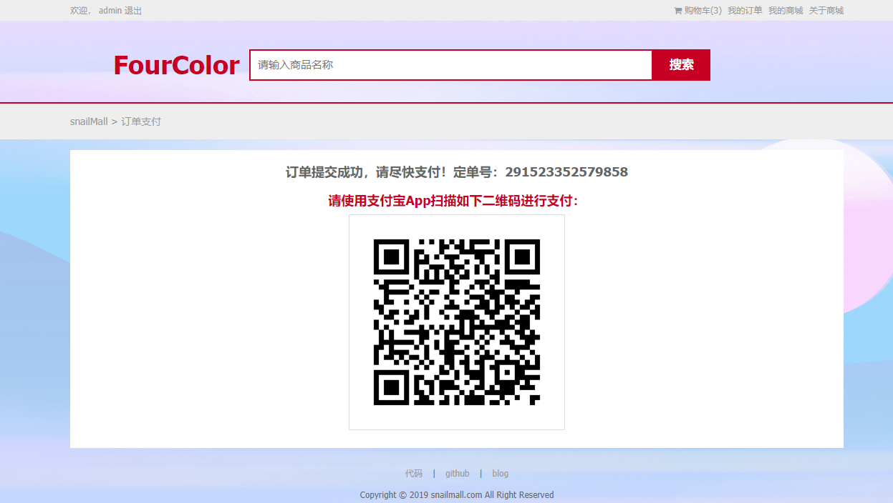

# 2018年的最后一天，对商城项目的架构做个改造

> 前方图片高能...更有几十兆gif演示动画，图片全部存放于七牛云上。

> 由于机器资源太少，很难做高可用，所以有的时候系统会挂掉一个两个服务，我会定时检查是否有服务挂掉，所以短期不可用是接受的。

一直以来都是学习慕课的实战视频，虽然也跟着做出了一些东西，但是思路都是别人提供好的，脱离了老师，我一直在问自己一个问题：**能不能独立地按照自己的思路做出一些东西来？**

带着这个想法，我想，做一个开源项目对于我来说还是很遥远，但是，我想从改造现有项目开始，逐步开启个人独立开发的序幕。

在去年，即2017年年底，我在慕课上学习了这两门课程：

第一期项目实现了比较简单的电商业务，整合SSM，并且部署到云端。

第二期实现了tomcat集群，配合redis实现分布式session，还有一些定时任务、redis分布式锁、maven环境隔离的一些东西，还涉及很多spring和springmvc的有用的机巧。

整体感觉是：一期实现业务，二期对于一期的提高不是太大，跟分布式无太大关系，仅仅实现了单点登陆和分布式session存储而已。

个人感觉下一期的课程应该是springCloud的分布式改造，进行服务拆分和治理。所以，在整合这两个课程的基础上用springCloud进行微服务治理。

## 项目详细描述

整体效果演示：

上面个gif有68兆，翻墙的话(我用的是免费的谷歌插件：SetupVPN，偶尔用用还是不错的)，可以很快加载出来，但是不翻墙基本上没这个耐心等了。下面贴个小一点的gif:

部分页面截图：

> 经过一遍遍测试，商城还是存在一些无伤大雅的bug，但是主要还是锻炼自己的能力嘛！
>
> 下订单的时候，报错：商品不存在或库存不足，是因为我模拟的秒杀，所以商品的库存要提前预置于redis中，后端管理系统的商品管理页面有预置库存的按钮。
>
> 新增商品的时候，对于上传图片，需要耐心等待一会，需要等待FTP服务器上传完毕，给一个返回信息(Map，是图片的文件名)才能真正显示（对于富文本中的图片上传，在上传之后需要等待一会，时间与小图上传差不多，否则直接保存不报错，但是前端看不到图，因为还没上传完毕,url还没回传回来）
>
> 普通注册的账号，没有管理员权限，所以不能登陆后台管理系统。
>
> 后来做了eureka集群，但是配置文件还是只指向其中一个eureka

在学习的视频中，一期只是实现业务功能，单体架构，一个tomcat。二期对其做了集群，并且解决了集群模式下session存储问题，实现了比较简单的单点登陆功能。架构如下：

对于上面的架构来说，只是做了一些集群进行优化，随着业务的发展，用户越来越多，用户服务等其他服务必然要拆分出来独立成为一个服务，这样做的好处是，一方面一个团队负责一个服务可以提高开发效率，另外，对于扩展性也是非常有利的，但是也是有缺点的，会带来很多的复杂性，尤其是引入了分布式事务，所以不能为了分布式而分布式，而是针对不同的业务场景而采用合适的架构。

微服务的实现，主要有两种，国内是阿里系的以dubbo+zookeeper为核心的一套服务治理和发现生态。另一个则是大名鼎鼎的spring cloud栈。

spring cloud并不是像spring是一个框架，他是解决微服务的一种方案，是由各种优秀开源组件共同配合而实现的微服务治理架构。下面的图是我构思的项目结构图：

最前面是`Nginx`，这里就作为一个静态资源映射和负载均衡，`nginx`中有几个配置文件，分别为`www.oursnail.cn.conf`，这个主要是对`zuul`网关地址做一个负载均衡，指向网关所在的服务器，并且找到前台页面所在位置对页面进行渲染。`admin.oursnail.cn.conf`，这个主要是配置后端以及后端的页面文件；`img.oursnail.cn.conf`是对图片服务器地址进行映射。

然后是`zuul`网关，这里主要是用来限流、鉴权以及路由转发。

再后面就是我们的应用服务器啦。对服务器进行了服务追踪(`sleuth`)，实现了动态刷新配置(`spring cloud config`+`bus`)等功能。以`http restful`的方式进行通信(`openFeign`),构建起以`eureka`为注册中心的分布式架构。

每个服务都是基于`springboot`打造，结合`mybatis`持久层操作的框架，完成基本的业务需求。`springboot`基于`spring`，特点是快速启动、内置`tomcat`以及无`xml`配置。将很多东西封装起来，引入pom就可以直接使用，比如`springMVC`就基本上引入`starter-web`即可。

由于资源的原因，只有三台最低配的服务器，所以本来想做的基于ES的全文检索服务没有做，也没有分库分表。

至于定时任务以及Hystrix服务熔断和降级，比较简单，就不做了。

- 项目的接口文档详见wiki：https://github.com/sunweiguo/spring-cloud-for-snailmall/wiki
- 项目的数据库表设计：snailmall.sql

下面详细介绍每个模块实现的大体思路（仅供参考，毕竟应届生，真实项目没做过）：

- 用户模块

关于用户模块，核心的功能是登陆。再核心是如何验证以及如何存储用户信息。这里采取的方案为：

对于用户注册，我这里就是用户名（昵称），那么如何保证不重复呢（高并发）？这里还是用了分布式锁来保证的。

对于未登陆章台下用户修改密码，逻辑为：

- 购物车模块

- 订单模块

针对这些问题，我想说一下我的思路。

对于幂等性，这里产生幂等性的主要原因在于MQ的重传机制，可能第一个消息久久没有发出去，然后重新发送一条，结果第一条消息突然又好了，那么就会重复发两跳，对于用户来说，只下一次单，但是服务器下了多次订单。网上解决这个问题的思路是创建一张表，如果是重复的订单号，就不可能创建多次了。还有一种可能方案是用分布式锁对该订单号锁住一段时间，由于只是锁住订单号，所以不影响性能，在这一段时间内是不可以再放同一个订单号的请求进来。

对于MQ消息不丢失，只能是订阅模式了。消息发出去之后，消费端给MQ回复一个接收到的信息，MQ本次消费成功，给订阅者一个回复。

对于全局唯一ID生成，这里用的是雪花算法，具体介绍可以看[我的笔记](https://github.com/sunweiguo/swgBook/blob/master/mamabuy/05-%E4%BA%A4%E6%98%93%E5%B7%A5%E7%A8%8B(%E4%B8%8A).md)

对于分布式事务，比较复杂，这里其实并没有真正处理，对于数据库扣减库存和数据库插入订单，他们在不同的数据库，廖师兄比较倾向的方式是：

这一切的基础还是需要有一个可靠的消息服务，确保消息要能送达。

针对redis预减库存存在的并发问题，这里的思路是用lua+redis，在预减之前判断库存是否够，这两个操作要在一个原子操作里面才行，lua恰好可以实现原子性、顺序性地操作。

- 支付模块

这里对接的是支付宝-扫码支付，用到是支付宝沙箱环境。支付的扫码支付详细流程在这里聊一聊哈。

商户前台将商品参数发送至商户后台，商户后台生成**内部订单号**并用于请求支付平台创建**预下单**，支付平台创建完预订单后将订单二维码信息返还给商户，此时用户即可扫取二维码进行付款操作。

内部订单号：这是相对于支付宝平台而言的，这个订单号是我们商城自己生成的，对于我们商城来说是内部订单号，但是对于支付宝来说是外部订单号。

将一系列的数据按照支付宝的要求发送给支付宝平台，包括商品信息，生成的验签sign，公钥；支付宝去将sign解密，进行商品的各种信息校验。校验通过，**同步**返回二维码串。

支付业务流程图：

在获取支付的二维码串之后，用工具包将其转换未二维码展示给用户扫码。

用户扫码后，会收到第一次支付宝的回调，展示要支付的金额，商品信息等。

用户输入密码成功后，正常情况会收到支付宝的第二次回调，即支付成功信息。

但是也可能会由于网络等原因，迟迟收不到支付宝的回调，这个时候就需要主动发起轮询去查看支付状态。

在支付成功之后，接收回调的接口要记得返回`success`告诉支付宝我已经收到你的回调了，不要再重复发给我了。接收回调的接口也要做好去除重复消息的逻辑。

这个流程是多么地简单而理所当然！

对应于代码层面，其实就是两个接口，一个是用户点击去支付按钮，此时发起预下单，展示付款二维码，另一个是接收支付宝回调：

预下单：

接收支付宝支付状态回调：

## 项目进展

- [x] 2018/12/31 完成了聚合工程的创建、Eureka服务注册中心、spring cloud config+gitHub+spring cloud bus（rabbitMQ）实现配置自动刷新--v1.0
- [x] 2018/12/31 将Eureka注册中心(单机)和配置中心部署到服务器上，这比较固定，所以先部署上去，以后本地就直接用这两个即可，对配置进行了一点点修改
- [ ] 2018/12/31 关于配置的自动刷新，用postman发送post请求是可以的，但是用github webhook不行，不知道是不是这个版本的问题
- [x] 2018/12/31 用户模块的逻辑实现,首先增加了一些pom文件的支持，整合mybatis，测试数据库都通过，下面就可以真正去实现业务代码了
- [x] 2019/1/1 完成用户注册、登陆、校验用户名邮箱有效性、查看登陆用户信息、根据用户名去拿到对应的问题、校验答案是否正确、重置密码这个几个接口，在注册这个接口，增加一个ZK分布式锁来防止在高并发场景下出现用户名或邮箱重复问题
- [x] 2019/1/2 上午完成门户用户模块所有接口--v2.0
- [x] 2019/1/2 下午完成品类管理模块，关于繁琐的获取用户并且鉴权工作，这里先放每个接口里面处理，后面放到网关中去实现--v3.0
- [x] 2019/1/3 上午引入网关服务，将后台重复的权限校验统一放到网关中去做，并且加了限流，解决了一下跨域问题。--v4.0
- [x] 2019/1/3 下午和晚上完成门户和后台的商品管理模块所有的接口功能，除了上传文件的两个接口没有测试以外，其他接口都进行了简单的测试，其中还用Feign去调用了品类服务接口--v5.0
- [x] 2019/1/3 初步把购物车模块和模块引入，通过基础测试，后面在此基础上直接开发代码即可，明天下午看《大黄蜂》，晚上师门聚餐吃火锅，明天早上赶一赶吧，今天任务结束！
- [x] 2019/1/4 整理了接口文档，并且画了一下购物车模块的流程图以及订单服务的流程图，针对订单服务中，记录了需要一些注意的问题，尽可能地完善，提高可用性和性能。并且完成购物车模块的controller层。
- [x] 2019/1/5 完成购物车模块，并且进行了简单的测试，这里进行了两处改造，一个是判断了一下是否需要判断库存；另一个是商品信息从redis中取，取不出来则调用商品服务初始化值
- [x] 2019/1/5 收货地址管理模块，这个模块就是个增删改查，没啥东西写，这里就不加缓存了。
- [x] 2019/1/6 完成了后台订单管理模块并且进行了测试，调用收货地址服务时，发现收货地址服务无法读取到cookie，通过这个方法(https://blog.csdn.net/WYA1993/article/details/84304243) 暂时解决了问题
- [x] 2019/1/6 预置所有商品库存到redis中；预置所有商品到redis中；大概确定好订单服务思路：预减库存（redis判断库存）---对userID增加分布式锁防止用户重复提交订单--MQ异步下订单
- [x] 2019/1/6 新增全局唯一ID生成服务，雪花算法实现
- [x] 2019/1/7 完善订单服务-这一块涉及跨库操作，并且不停地调用其他服务，脑子都快晕了，这里采取的策略是：用到购物车的时候，去调用购物车服务获取；产品详情从redis中获取。首先将商品以及商品库存全部缓存到redis中，然后用户下单，先从redis中判断库存，够则减，判断
和扣减放在lua脚本中原子执行，然后MQ异步出去生成订单（生成订单主表和订单详情表放在一个本地事务中），这两步操作成功之后，再用MQ去异步删除购物车。MQ消费不成功则重试。
对于扣减库存这一步，想法是用定时任务，定时与redis中进行同步。这里是模拟了秒杀场景，预减库存+MQ异步，提交订单-->redis判断并且减库存-->调用cart-service获取购物车-->MQ异步(userId,shippingId)生成订单主表和详情表-->上面都成功，则MQ异步(userId)
去清除购物车，库存用定时任务去同步(未做)，理想的做法是：MQ异步扣减库存，订单服务订阅扣减库存消息，一旦库存扣减成功，则进行订单生成。
- [x] 2019/1/8 继续完善订单接口，完成支付服务，就直接放在订单服务里面了，因为与订单逻辑紧密，就放在一起了。
- [x] 2019/1/8 使用了一下swagger，发现代码侵入比较强，每一个接口上面都要手动打上响应的注解
- [x] 2019/1/8 关于hystrix熔断与降级，可以引入hystrix的依赖，用@HystrixCommand注解来控制超时时间、服务降级以及服务熔断。也可以直接再@FeignClient接口中指定服务降级的类，这里不演示了，因为设置比如超时时间，我还要重新测试，写起来很简单，测起来有点儿麻烦
- [x] 2019/1/9 服务跟踪，服务端是直接用的线程的，只需要下载：wget -O zipkin.jar  'https://search.maven.org/remote_content?g=io.zipkin.java&a=zipkin-server&v=LATEST&c=exec'，然后nohup java -jar zipkin.jar > zipkin.server.out & ，开放9411端口，打开浏览器http://ip:9411看到页面即可。
客户端只需要添加相应依赖和配置文件即可。用客户端测试，发现死活不出现我的请求，经过搜索，发现需要增加spring.zipkin.sender.type= web这个配置项才行.
- [x] 2019/1/10 初步把项目部署到服务器上，进行测试，bug多多，修改中...
- [x] 2019/1/10 改了一天的bug，其中网关的超时时间以及feign的超时时间都要改大一点，否则会超时报错。最终成功，花了三台服务器，部署了11个服务。后面把部署过程写一下。
- [x] 2019/1/11 将注册中心做成集群，因为早上一起来，注册中心挂了？？？
- [ ] 2019/1/11 docker部署(商城第四期的改造目标:容器化+容器编排)，本期改造结束。
- [x] 2019/1/11 完善readme文档
- [x] 2019/1/12 两次发现redis数据被莫名其妙清空，我确定不是缓存到期，为了安全起见，设置了redis的密码，明天看缓存数据还在不在。
- [x] 2019/1/14 redis数据没有再丢失，修复用户更新信息的bug

## 项目启动

安装redis、zookeeper、mysql、jdk、nginx以及rabbitMQ。

对代码进行maven-package操作。打包成jar包。将其放到服务器上：

执行`nohup java -jar snailmall-user-service.8081 > user-service.out &`后台启动即可。

> 补充：针对配置刷新，修改了github信息，用`postman`请求`http://xxxxx:8079/actuator/bus-refresh` 触发更新。
>
> 本改造是基于[快乐慕商城一期](https://coding.imooc.com/class/96.html)和[快乐慕商城二期](https://coding.imooc.com/class/162.html)的基础上进行改造。所以需要在其业务基础上改造会比较顺手。关于微服务，尤其是电商中的一些处理手段，很多思路都是学习于[码吗在线](http://coder520.com/)中分布式电商项目。再加上慕课网廖师兄的[spring cloud微服务实践](https://coding.imooc.com/class/187.html)。

## 前台项目

只要阅读`readme`文档即可。代码仓库为：https://github.com/sunweiguo/snailmall-front

学习不仅要有输入，更要有自己的输出，实践是提升的捷径！
